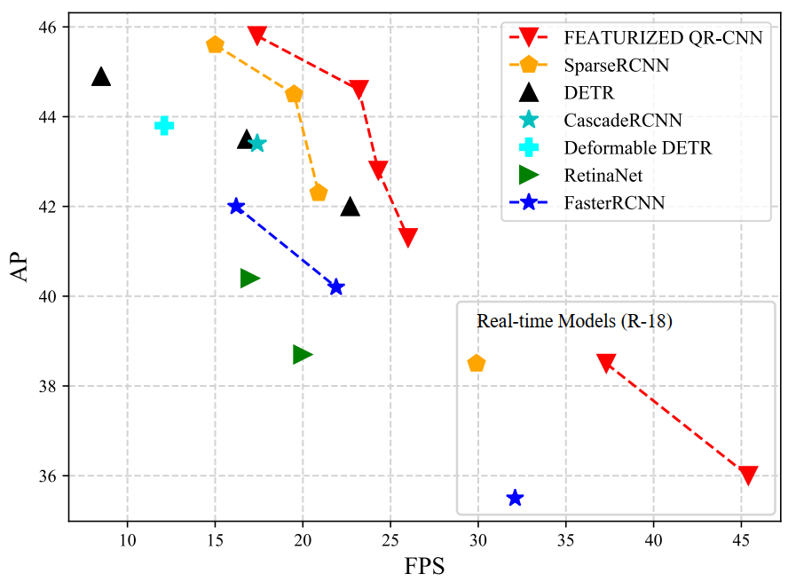
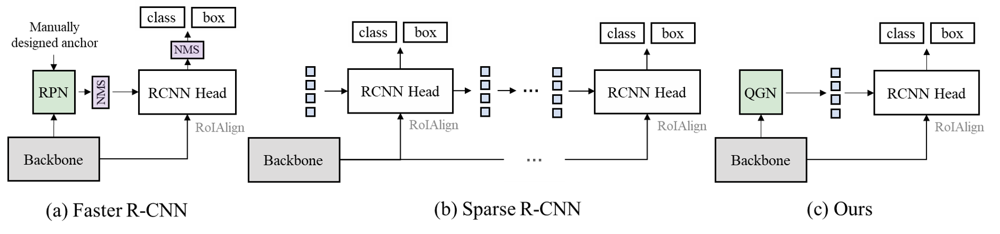

<div align="center">
<h1>Featurized Query R-CNN</h1>

Wenqiang Zhang*, Tianheng Cheng*, <a href="https://xinggangw.info/">Xinggang Wang</a><sup><span>&#8224;</span></sup>, Shaoyu Chen, <a href="https://scholar.google.com/citations?user=pCY-bikAAAAJ&hl=zh-CN">Qian Zhang</a>, <a href="http://eic.hust.edu.cn/professor/liuwenyu/"> Wenyu Liu</a>
</br>
(<span>*</span>: equal contribution, <span>&#8224;</span>: corresponding author)

<!-- <div><a href="">[Project Page]</a>(comming soon)</div>  -->
<div><a href="https://arxiv.org/abs/2206.06258">[arXiv]</a></div>




</div>

## News

* `14 June, 2022`: Code and models of Featurized Query R-CNN have been released!


## Introduction

The query mechanism introduced in the DETR method is changing the paradigm of object detection and recently there are many query-based methods have obtained strong object detection performance. However, the current query-based detection pipelines suffer from the following two issues. Firstly, multi-stage decoders are required to optimize the randomly initialized object queries, incurring a large computation burden. Secondly, the queries are fixed after training, leading to unsatisfying generalization capability. To remedy the above issues, we present featurized object queries predicted by a query generation network in the well-established Faster R-CNN framework and develop a Featurized Query R-CNN. Extensive experiments on the COCO dataset show that our Featurized Query R-CNN obtains the best speed-accuracy trade-off among all R-CNN detectors, including the recent state-of-the-art Sparse R-CNN detector.



## Installation and Training

Our methods are based on [detectron2](), please refer to [here]() for more details.

Install the detectron2:

```
git clone https://github.com/facebookresearch/detectron2.git

python setup.py build develop
```

For training, run:

```
python train_net.py --config-file <config-file> --num-gpus <num-gpus>
```

## Main Results

|  Model                                   | Backbone   | Epoch | AP   | FPS  | Weights |
| ---------------------------------------- | ---------- | ----- | ---- | ---- | ------- |
| [Featurized QR-CNN (100 Queries)](configs/queryrcnn.res50.100pro.3x.yaml)           | ResNet-50  | 36    | 41.3 | 26   |[Google Drive](https://drive.google.com/file/d/19-UcZy8AtVghtjD8X9FrnftVqolJ0AwO/view?usp=sharing)|
| [Cascade Featurized QR-CNN (100 Queries)](configs/queryrcnn.cascade.res50.100pro.3x.yaml) | ResNet-50  | 36    | 43.0 | 24   |[Google Drive](https://drive.google.com/file/d/1bg_H4Ewaa8KkE31QLyhL8X6PnknRNYQT/view?usp=sharing)|
| [Cascade Featurized QR-CNN (300 Queries)](configs/queryrcnn.cascade.res50.300pro.3x.yaml) | ResNet-50  | 36    | 44.6 | 24   |[Google Drive](https://drive.google.com/file/d/1ZMH18xy7cfhPDYWL8kHoxMTWDLJXD5Y2/view?usp=sharing)|
| [Cascade Featurized QR-CNN (100 Queries)](configs/queryrcnn.cascade.res101.100pro.3x.yaml) | ResNet-101 | 36    | 43.9 | 18   |[Google Drive](https://drive.google.com/file/d/1oQFBhx5k8EeaDY34t_XhOMy8UrHrxj_U/view?usp=sharing)|
| [Cascade Featurized QR-CNN (300 Queries)](configs/queryrcnn.cascade.res101.300pro.3x.yaml) | ResNet-101 | 36    | 45.8 | 17   |[Google Drive](https://drive.google.com/file/d/1Epx1e7Xg9XQYsGmocBMlBHvZq5MtR4kr/view?usp=sharing)|

- The speed is tested on a single RTX 2080Ti GPU on COCO val set.
- If you have trouble accessing the models in Google Drive, we also provide the models in [BaiduPan](https://pan.baidu.com/s/1uLZI7iLtg9foZD8KzJ9hQw) for you (Password: **n91e**).

## Acknowledgements

Our implementation is based on [detectron2](https://github.com/facebookresearch/detectron2) and [Sparse R-CNN](), we thank for their open-source code.


## License

Featurized Query R-CNN is released under the [MIT Licence](LICENSE).

## Citation

If you find Featurized Query R-CNN is useful in your research or applications, please consider giving us a star &#127775; and citing it by the following BibTeX entry.

```bibtex
@article{FeaturizedQR-CNN,
  title={Featurized Query R-CNN},
  author={Zhang, Wenqiang and Cheng, Tianheng and Wang, Xinggang and Chen, Shaoyu and Zhang, Qian and Liu, Wenyu},
  journal={arXiv preprint arXiv:2206.04584},
  year={2022}
}
```
